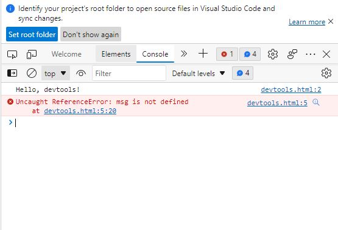

# What is JavaScript?
Programming language designed to interact with web pages, In Web browsers, JavaScript mainly consists of three parts:
1. ECMA Script- Provides core functionlaity
2. Document Object model (DOM)- provides interfaces for interacting with elements on web pages
3. Browser Object Model(BOM)- provides browser API for interacting with web browser

JS adds interactivity, uses HTML and CSS to enhance web page functionality for validating forms, creating interactive maps and displaying animated charts.

Basically when web page is loaded, i.e when HTML and CSS have been downloaded, JavaScript Engine in the web browser executes the JavaScript code, The JavaScript code modifies the HTML and CSS to update the user interface dynamically.

JS engine is a program that executes JS code, Earlier JS engine were interpreters, Now JS Engines are implemented as just-in-time compilers to improve performance.

# Client-side vs. Server-side JavaScript
Client-side: When JavaScript used on a web page, executed in browsers

Server-Side: Runs o both web browsers and servers, Node.js is one popular server side environment, Server-side Javascript executes on the server that allows you to access databases, file systems, etc.
When JavaScript is used on a web page, it is executed in web browsers. In this case, JavaScript works as a client-side language.

JavaScript can run on both web browsers and servers. A popular JavaScript server-side environment is Node.js. Unlike client-side JavaScript, server-side JavaScript executes on the server that allows you to access databases, file systems, etc.

# JavaScript History
JavaScript was created by Netscape developer Brendan Eich, first named as Mocha, then to LiveScript, later Netscape decided to change it to JavaScript just before they released its Netscape browser product Netscape Navigator 2, which was JavaScript version 1.0.

Netscape released JavaScript 1.1, also Microsoft released a web browser called Internet Explorer(IE), called JScript.

Two different JS versions were in the market: JavaScript in Netscape Navigator and JScript in Internet Explorer

Hence, two different JavaScript versions were in the market:

JS had no standards governed for its syntax and features, so community decided to standardize the language, after several decisions, the International Organization for Standardization and International Electrotechnical Commissions (ISO/IEC) adopted ECMAScript (ISO/IEC-16262).

# JavaScript Overview
### Declare variable in JavaScript:
use **var** keyword:

var x=10;

var y=20;

### ES6 uses let keyword to declare variable:
let x=10;

let y=20;

### Declaring a function using function keyword:
function add(a,b) {

return a+b;

}

### call add() function using following call:
let result=add(x,y);

### To print the result
console.log(result); //Print 30 in console window

### Provides conditional statements if..else, switch statements
let a=20, b=30;

function divide(a,b) {

  if(b==0) {
    
      throw 'Division by Zero';
    
  }
  
  return a/b;
  
 }
 
 ### Declare, inititalize, length , iterate over array
 
 let lists=[];
 
 let lists=[1,2,3]
 
 console.log(lists.length); //3
 
 for(let i=0; i< lists.length; i++) {
 
  console.log(list[i]);
  
 }
 
 for(let list of lists) {
 
  console.log(list);
  
 }
 
 # JavaScript Code Editors
 
 The following are some popular JavaScript code editors:
1. Visual Studio Code
2. Atom
3. Notepad++
4. Vim
5. GNU Emacs

# Visual Studio Code
Visual Studio Code is a free and open-source code editor developed by Microsoft. Visual Studio Code is often called VS Code.

Download Visual code: https://code.visualstudio.com/download

### Installing on Windows:
To install the VS Code on Windows, you follow these steps:
First, execute the installer from the downloaded file. Then, open the Visual Studio code. Note that the installer will add the Visual Studio Code to your %PATH%. It will allow you to type the command code . to launch the VS Code on that folder.

Installing the Live Server extension
The live server extension allows you to launch a development local server with the hot reload feature for static pages. Once you change the JavaScript code, you don’t need to refresh the page to see the changes.

### To install the Live Server extension, you follow these steps:
1. First, click the Extensions.
2. Second, search for the Live Server and select the Live Server extension on the list.
3. Finally, click the Install button.

### Web development Tools
Modern web browsers such as Google Chrome, Firefox, Edge, Safari, and Opera provide the devtools as built-in features.

Generally, devtools allow you to work with a variety of web technologies such as HTML, CSS, DOM, and JavaScript.

Here, you will learn how to open the Console tab of the devtools to view messages output by JavaScript.

Run the html code in the browser:

In the browser, access More tools--> Development tools

Error is because the variable msg has not been defined in the code but was referenced in the assignment.

Now, you can see both normal messages issued by the console.log() and the error messages. 

