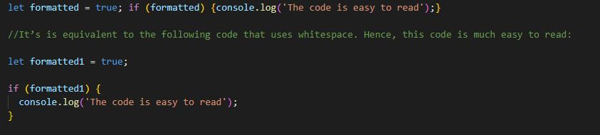

# JavaScript Fundamentals

Here we will learn about JavaScript syntax, including whitespace, statements, identifiers, comments, expressions, and keywords.

# Whitespace
Refers to characters with a space between other characters, JS has whitespaces related to: Carriage return, Space, New line, Tab.
JS Engine ignores the whitespace, but the usage of whitespace is recommended to enhance the readability and manitainance of the code with a proper indentation.

JS bundlers remove all whitespaces and puts them in a single file for deployment, this way bundlers make JS code lighter and faster in web browsers

# Statements
Statement declares a variable or instructs a JS engine to do certain tasks, Statements are terminated by semicolon (;).

# Blocks
A block is a sequence of zero or more simple statements. A block is delimited by a pair of curly brackets {}

# Identifiers
Its a name given to a variables, parameters, function, classes etc. 

An identifier name starts with a letter (a-z, or A-Z), an underscore(_), or a dollar sign ($) and is followed by a sequence of characters including (a-z, A-Z), numbers (0-9), underscores (_), and dollar signs ($).

Identifiers are case-sensitive. 

# Comments
used to add notes to the code, JS engine ignores it while in execution. Supports Single line and multi line comment

# Single-line comments
Starts with (//)

# Block comments
Begins with forward slash and asterisk /* and ends with */.

# Expressions
Evaluates to a value.

# Keywords & Reserved words
Cannot be used as identifiers

Some of the Future reserved words which cannot be used as identifiers.

An example showcasing whitespaces, statements, comments, Expression, blocks etc.

# Summary
1. Use whitespace including cariage return, space, newline, and tab to format the code. The JavaScript engine ignores the whiespace.
2. Use a semicolon (;) to terminate a simple statement.
3. Use the curly braces ({}) to form a block that groups one or more simple statments.
4. A single-line comment start with // followed by a text. A block comment begins with /* and ends with */. JavaScript engine also ignores the comments.
5. Identifers are names that you choose for variables, functions, classes, etc.
6. Do not use the reserved keywords and reserved words for identifers.
