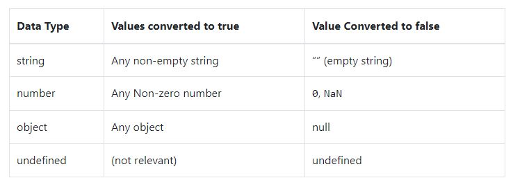
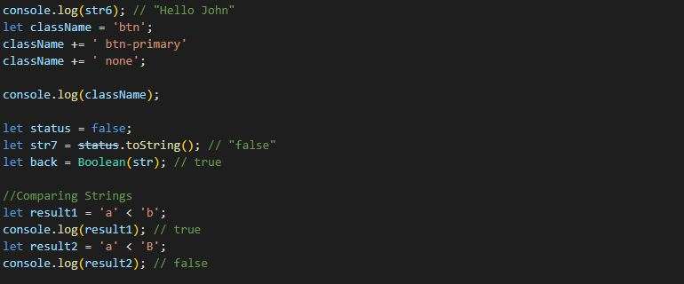

# JavaScript Fundamentals

Here we will learn about JavaScript syntax, including whitespace, statements, identifiers, comments, expressions, and keywords.

### Whitespace
Refers to characters with a space between other characters, JS has whitespaces related to: Carriage return, Space, New line, Tab.
JS Engine ignores the whitespace, but the usage of whitespace is recommended to enhance the readability and manitainance of the code with a proper indentation.

JS bundlers remove all whitespaces and puts them in a single file for deployment, this way bundlers make JS code lighter and faster in web browsers

### Statements
Statement declares a variable or instructs a JS engine to do certain tasks, Statements are terminated by semicolon (;).

### Blocks
A block is a sequence of zero or more simple statements. A block is delimited by a pair of curly brackets {}

### Identifiers
Its a name given to a variables, parameters, function, classes etc. 

An identifier name starts with a letter (a-z, or A-Z), an underscore(_), or a dollar sign ($) and is followed by a sequence of characters including (a-z, A-Z), numbers (0-9), underscores (_), and dollar signs ($).

Identifiers are case-sensitive. 

### Comments
used to add notes to the code, JS engine ignores it while in execution. Supports Single line and multi line comment

### Single-line comments
Starts with (//)

### Block comments
Begins with forward slash and asterisk /* and ends with */.

### Expressions
Evaluates to a value.

### Keywords & Reserved words
Cannot be used as identifiers

Some of the Future reserved words which cannot be used as identifiers.

An example showcasing whitespaces, statements, comments, Expression, blocks etc.

### Summary
1. Use whitespace including cariage return, space, newline, and tab to format the code. The JavaScript engine ignores the whiespace.
2. Use a semicolon (;) to terminate a simple statement.
3. Use the curly braces ({}) to form a block that groups one or more simple statments.
4. A single-line comment start with // followed by a text. A block comment begins with /* and ends with */. JavaScript engine also ignores the comments.
5. Identifers are names that you choose for variables, functions, classes, etc.
6. Do not use the reserved keywords and reserved words for identifers.

# JavaScript Variables
We will learn about JavaScript variables and how to use variables to store values in the application.

A variable is a label that references a value like a number or string. Before using a variable, you need to declare it.

### Declaring a Variable
Use **var** keyword followed by the variable name

**var var_name;**

if no value is assigned, variable will have a **undefined value** in it, variable names follows the rule of identifiers, by convention variable **uses camel case**.

In **ES6 let** keyword is used to declare a variable.

**let var_name;**

Its always good practice to declare variable name using let keyword, there are further differences between declaring with let and var which will be discussed later

### Initialize a variable
Once a variable is declared, initialize a variable by using equal(=) sign. Different ways of initializing a variable is shown below.

**let message="Hello";**

**let message1="HelloWorld", counter=50;**

**let message2="World";**

**message2="Hello";**

### Undefined vs Undeclared variables
**let message;**

**console.log(message); //Undefined variable**

**console.log(coounters); //Undeclared variable**

### Constants
Constants hold value that doesnot change.

**const x=10;**

**x=20; //throws an error**

### Summary
1. A variable is a label that references a value.
2. Use the let keyword to declare a variable.
3. An undefined variable is a variable that has been declared but not initialized while an undeclared variable is variable that has not been declared.
4. Use the const keyword to define a readonly reference to a value.

# JavaScript DataTypes
We list available datatype in JavaScript and its characteristics

Primitive datatypes in JavaScript

1. null
2. undefined
3. boolean
4. number
5. string
6. symbol – available from ES2015
7. bigint – available from ES2020
8. and a complex data type object.

Example demonstrating all the primitive datatypes:

### The Object type
In JavaScript, an object is a collection of properties, where each property is defined as a key-value pair.

The following example defines an empty object using the object literal syntax:

### Summary
JavaScript has the primitive types: number, string, boolean, null, undefined, symbol and bigint and a complex type: object.

# number
We will learn about the JavaScript number types and how to use them effectively.

### Summary
JavaScript Number type reprensents both integer and floating-point numbers.

# JavaScript Numeric Separator
use the JavaScript numeric separator to make the numeric literals more readable.

The numeric separator allows you to create a visual separation between groups of digits by using underscores (_) as separators.

### Summary
Use underscores (_) as the numeric separators to create a visual separation between group of digits.

# Octal and Binary Literals

learn how to represent the octal and binary literals in ES6

ES5 provided numeric literals in octal (prefix 0), decimal (no prefix), and hexadecimal (0x). ES6 added support for binary literals and changed how it represents octal literals.

### Summary
1. Octal literals start with 0o followed by a sequence of numbers between 0 and 7.
2. Binary literals start with 0b followed by a sequence of number 0 and 1.

# JavaScript Boolean Type
learn about the JavaScript boolean type that has two literal values true and false

The JavaScript boolean primitive type has two literal values: true and false.

table shows how the Boolean() function casts the values of other types to boolean values:

This table is important because some statements automatically cast a non-boolean value to a boolean value using the Boolean() function.

For example, the if statement executes a block if a condition is true. If you use a non-boolean value, it’ll use the Boolean() function to implicitly cast that value to a boolean value.

### Summary
1. JavaScript boolean type has two literal values true and false.
2. Use the Boolean() function to cast a non-boolean values to a boolean value.
3. Some statements implicitly cast a non-boolean value into a boolean value.

# JavaScript String
 learn about the JavaScript string primitive type and how to use it to define strings.
 
 JavaScript strings are primitive values. Also, strings are immutable.
 To create literal strings, you use either single quotes (') or double quotes (")
 
 ### Escaping Special Characters
 To escape special characters, you use the backslash \ character. For example:

1. Windows line break: '\r\n'
2. Unix line break: '\n'
3. Tab: '\t'
4. Backslash '\'

### Converting Values to String
To convert a non-string value to a string, you use one of the following:

1. String(n);
2. ” + n
3. n.toString()
4. Note that the toString() method doesn’t work for undefined and null.

When you convert a string to a boolean, you cannot convert it back

### Summary
1. JavaScript strings are primitive values and immutable.
2. Literal strings are delimited by single quotes ('), double quotes ("), or backticks (`).
3. The length property returns the length of the string.
4. Use the comparison operators `>, >=, <, <=, == to compare strings.

# JavaScript Objects
learn about JavaScript objects and how to manipulate object properties effectively.

In JavaScript, an object is an unordered collection of key-value pairs. Each key-value pair is called a property.

The key of a property can be a string. And the value of a property can be any value, e.g., a string, a number, an array, and even a function.

JavaScript provides you with many ways to create an object. The most commonly used one is to use the object literal notation.

### Summary
1. An object is a collection of key-value pairs.
2. Use the dot notation ( .) or array-like notation ([]) to access a property of an object.
3. The delete operator removes a property from an object.
4. The in operator check if a property exists in an object.

# JavaScript Primitive Vs Reference values
JavaScript has two different types of values:

1. Primitive values
2. Reference values
Primitive values are atomic pieces of data while reference values are objects that might consist of multiple values.

Stack and heap memory
When you declare variables, the JavaScript engine allocates the memory for them on two memory locations: stack and heap.

Static data is the data whose size is fixed at compile time. Static data includes:

Primitive values (null, undefined, boolean, number, string, symbol, and BigInt)
Reference values that refer to objects.
Because static data has a size that does not change, the JavaScript engine allocates a fixed amount of memory space to the static data and store it on the stack.

For example, the following declares two variables and initializes their values to a literal string and a number:

Because name and age are primitive values, the JavaScript engine stores these variables on the stack as shown in the following picture:

Unlike the stack, JavaScript stores objects (and functions) on the heap. The JavaScript engine doesn’t allocate a fixed amount of memory for these objects. Instead, it’ll allocate more space as needed.

The following example defines the name, age, and person variables:

Internally, the JavaScript engine allocates the memory as shown in the following picture:

In this picture, JavaScript allocates memory on the stack for the three variables name, age, and person.

The JavaScript engine creates a new object on the heap memory. Also, it links the person variable on the stack memory to the object on the heap memory.

Because of this, we say that the person variable is a reference that refers to an object.

### Dynamic properties
A reference value allows you to add, change, or delete properties at any time. For example:

Output:

Unlike a reference value, a primitive value cannot have properties. This means that you cannot add a property to a primitive value.

JavaScript allows you to add a property to a primitive value. However, it won’t take any effect. For example:

Output:

### Copying values
When you assign a primitive value from one variable to another, the JavaScript engine creates a copy of that value and assigns it to the variable. For example:

On the stack memory, the newAge and age are separate variables. If you change the value of one variable, it won’t affect the other.

When you assign a reference value from one variable to another, the JavaScript engine creates a reference so that both variables refer to the same object on the heap memory. This means that if you change one variable, it’ll affect the other.

First, declare a person variable and initialize its value with an object with two properties name and age.

Second, assign the person variable to the member variable. In the memory, both variables reference the same object, as shown in the following picture:

Third, change the age property of the object via the member variable:

Since both person and member variables reference the same object, changing the object via the member variable is also reflected in the person variable.

### Summary
1. Javascript has two types of values: primitive values and reference values.
2. You can add, change, or delete properties to a reference value, whereas you cannot do it with a primitive value.
3. Copying a primitive value from one variable to another creates a separate value copy. It means that changing the value in one variable does not affect the other.
4. Copying a reference from one variable to another creates a reference so that two variables refer to the same object. This means that changing the object via one variable reflects in another variable.

#JavaScript Arrays
In JavaScript, an array is an ordered list of values. Each value is called an element specified by an index.

An JavaScript array has the following characteristics:

1. First, an array can hold values of mixed types. For example, you can have an array that stores elements with the types number, string, and boolean.
2. Second, the size of an array is dynamic and auto-growing. In other words, you don’t need to specify the array size upfront.

### Summary
1. In JavaScript, an array is an order list of values. Each value is called an element specified by an index.
2. An array can hold values of mixed types.
3. JavaScript arrays are dynamic, which mean that they grow or shrink as needed.

