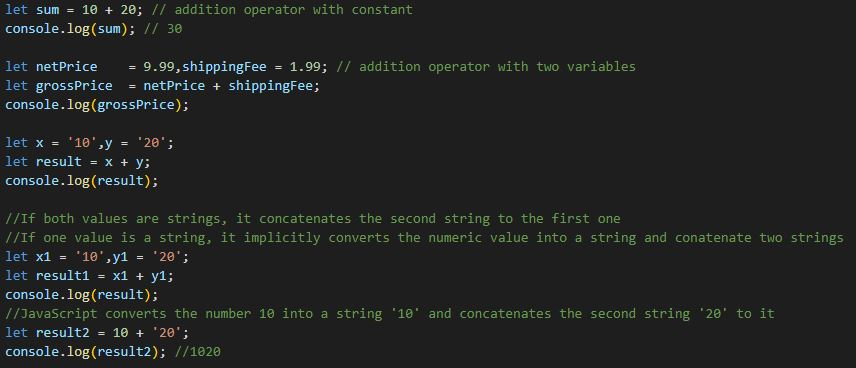
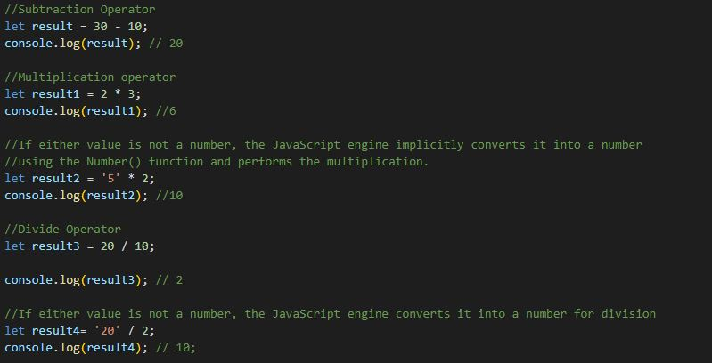
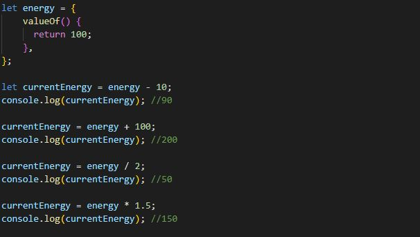
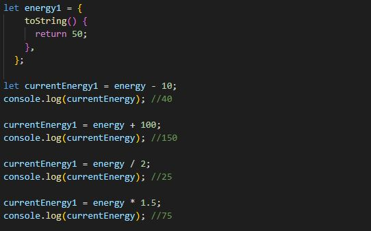

# JavaScript Operators

# JavaScript Arithmetic Operators (+, -, *, /)

### Addition Operator

### Subtraction, Multiplication and Division Operator

### JavaScript Operators with Objects

If a value is an object, the JavaScript engine will call the valueOf() method of the object to get the value for calculation.

If the object doesn’t have the valueOf() method but has the toString() method, the JavaScript engine will call the toString() method to get the value for calculation. 

### Summary
Use the JavaScript arithmetic operators including addition (+), subtraction (-), multiply (*) and divide (/) to perform arithmetic opeations.

