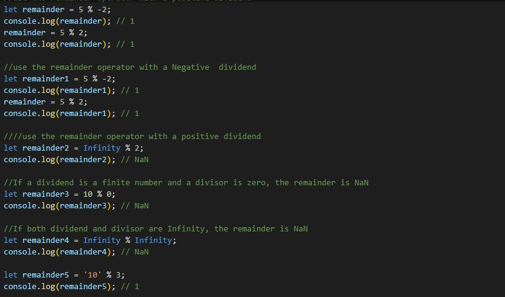
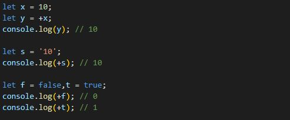
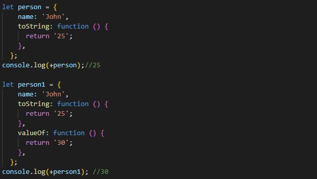
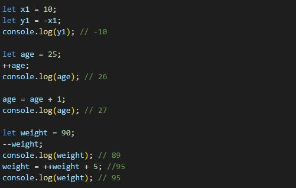
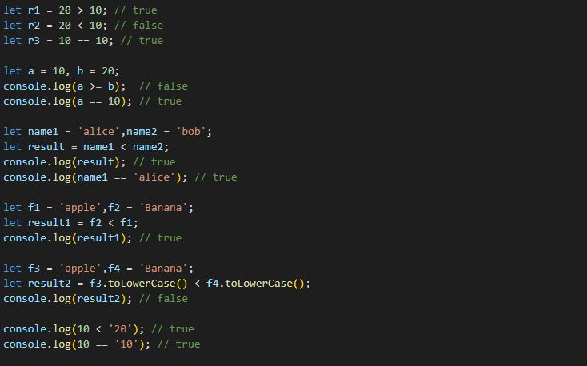
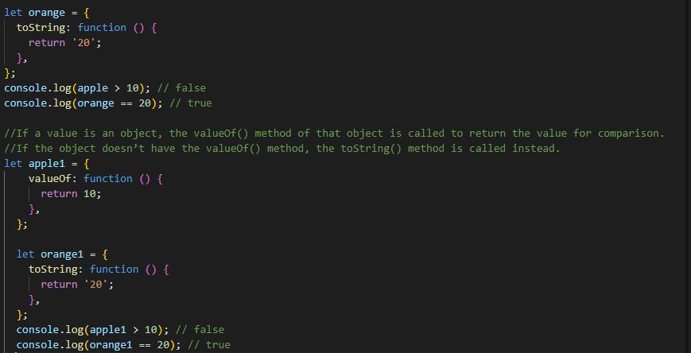
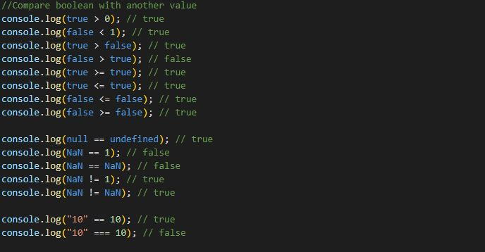
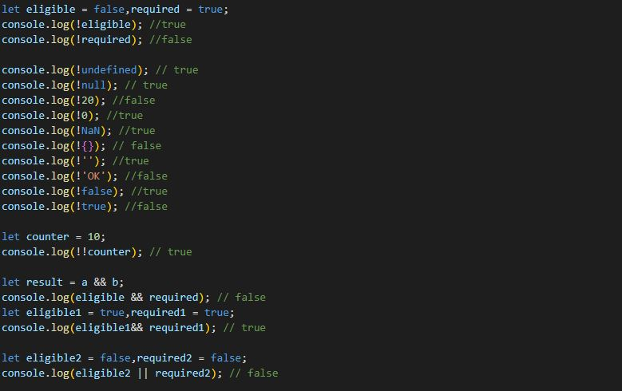

# JavaScript Operators

# JavaScript Arithmetic Operators (+, -, *, /)

### Addition Operator

### Subtraction, Multiplication and Division Operator

### JavaScript Operators with Objects

If a value is an object, the JavaScript engine will call the valueOf() method of the object to get the value for calculation.

If the object doesn’t have the valueOf() method but has the toString() method, the JavaScript engine will call the toString() method to get the value for calculation. 

### Summary
Use the JavaScript arithmetic operators including addition (+), subtraction (-), multiply (*) and divide (/) to perform arithmetic opeations.

# Remainder Operator (%)

# Assignment Operator

### Summary
1. Unary operators work on one value.
2. Unary plus (+) or minus (-) converts a non-numeric value into a number. The unary minus negates the value after the conversion.
3. The prefix increment operator adds one to a value. The value is changed before the statement is evaluted.
4. The postfix increment operator adds one to a value. The value is changed after the statement is evaluted.
5. The prefix decrement operator subtracts one from a value. The value is changed before the statement is evaluted.
6. The postfix decrement operator subtracts one from a value. The value is changed after the statement is evaluted

# Comparision Operator

# Logical Operators

1. ! (Logical NOT)
2. || (Logical OR)
3. && (Logical AND)

### Logical Operator Precedence
The precedence of the logical operator is in the following order from the highest to the lowest:

1. Logical NOT (!)
2. Logical AND (&&)
3. Logical OR (||)

### Summary
1. The NOT operator (!) negates a boolean value. The (!!) converts a value into its real boolean value.
2. The AND operator (&&) is applied to two Boolean values and returns true if both values are true.
3. The OR operator (||) is applied to two Boolean values and returns true if one of the operands is true.
4. Both && and || operator are short-circuited. They can be also applied to non-Boolean values.
5. The logical operator precedence from the highest to the lowest is !, && and ||

