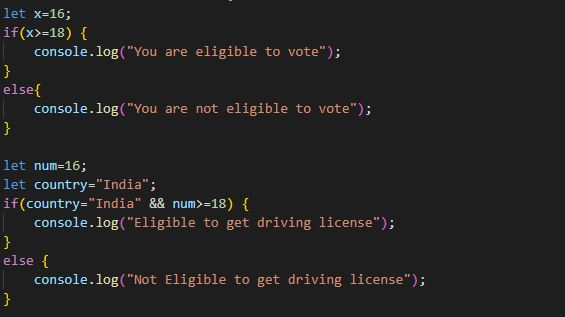

# JavaScript Control Flow Statements

## if statement, Nested if statement
The **if** statment executes the block if condition is **true**.
Condition can be **value or an expression** that evaluates to **true or false**.
If we use **if statement inside a if statement** its called **Nested If statement**

## if.. else statement
The if statement executes a block when a condition evaluates to true, but when the condition is false it does nothing. **To add a executable statements for false condition we need to use if else statement.**

## if else if statement
if...else...if statement to check multiple conditions and execute the corresponding block if a condition is true.

## Ternary Operator
The ternary operator is a simplified conditional operator like if / else.
Syntax: condition ? <expression if true> : <expression if false>

## JavaScript Spread Operator
The spread operator is a new addition to the features available in the JavaScript ES6 version.

The spread operator ... is used to expand or spread an iterable or an array.

## JavaScript Switch statement
The switch statement evaluates an expression and executes the corresponding body that matches the expression's result.

## JavaScript Loop statement

## Summary
Understood the use of conditional statements, loops, Spread and ternary operator, break, continue, loops

